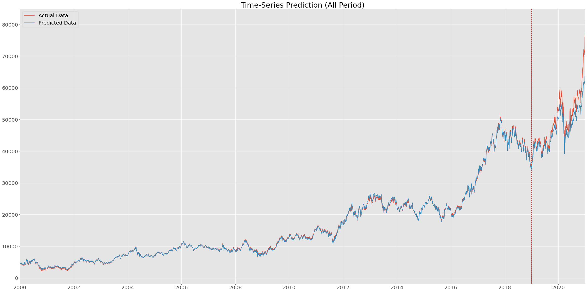
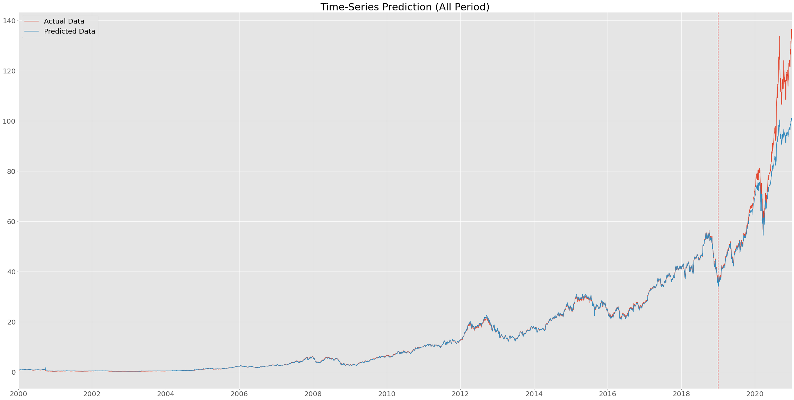
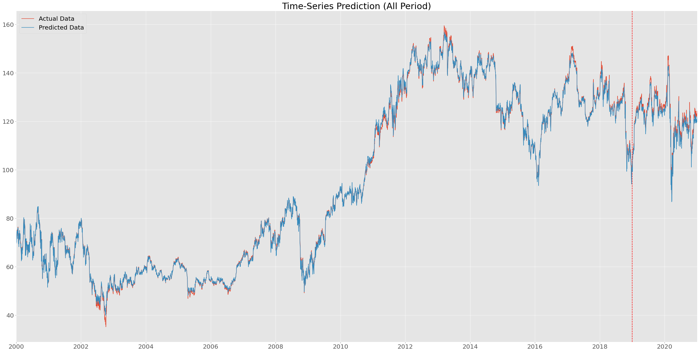
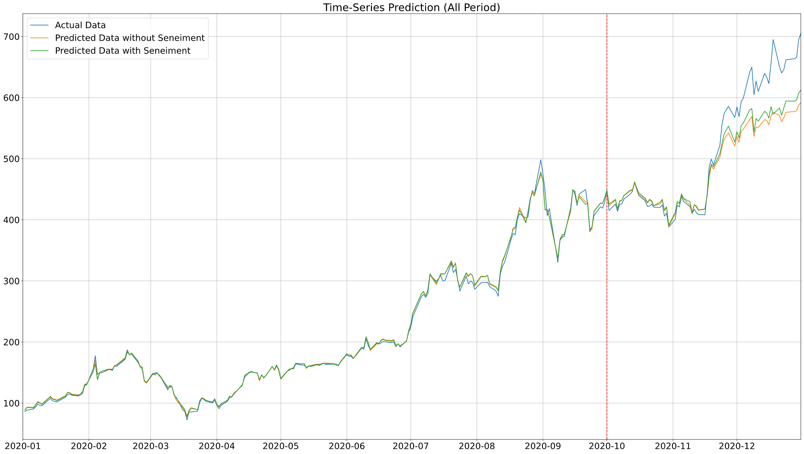

# :chart_with_upwards_trend: Stock Prediction Model

A model about stock price prediction by using machine learning.

## :bulb: Introduction

One hundred percent precise stock prediction is ... everyone's dream, we can use machine learning to do so ... anyway, let's directly introduce to our model. 

This project is based on LSTM structure and GRU structure to predict the one-line time series stock trend. 

Features: 

- **Easy to use**: just by runninng `python3 train.py` and `python3 test.py` you can run the model and get the result. 
- **Easy to controling**: all peremeters are in single file `config.ini`, just modify this one to controll the whold model. 
- **Easy to modify**: all source code is well object-oriented organized, reuse models, utils would be easy. 
- **Works for different dataset**: any dataset follows the structure of example in csv can be used, just put your dataset in data folder and run. 

**v1.1 Update** Sentiment analysis method now is available! We can add sentiment data from Tweeter as a new feature for prediction. For more detail about using, please refer to How to use part. 

## :wrench: Envirenment 

``` Python
Python Version: 3.6 or later
Python Packages: torch, numpy, matplotlib, sklearn
```

## :file_folder: Structure

### Folders

- `data`: datasets will be here
    - `ori`: the original dataset files, examples here are `.csv` files
    - `trans`: the transferred dataset files, would be `.npy` files, the `train.py` process will do it 
- `save`: trained model will be saved here
- `src`: all source code will be here
    - `models`: all models' class file will be here
    - `utils`: tool functions like dataset transfer will be here 
- `fig`: all results figs and images for readme will be here

### Files

- `train.py`: the process for trinning the model, trained model will be saved 
- `test.py`: the process for test the model, the model will be loaded from `save` folder
- `config.ini`: all hyperpremeters and process controls will be here, just modify a single file 
- `README.md`: you are reading now

## :floppy_disk: How to use

Step 1. Download or Clone this repository. 

Step 2. Run `train.py` to transfer the example original dataset to numpy files and then use it to train the model. After trainning, the model will be saved in `save` folder. 

Step 3. Run `test.py` to test the example, the running result will be saved as figs in `fig` folder. 

Step 4. After testing the example, you can modify the `congif.ini` to test different parameters and generate your results. And modify modules to get what you want. Here are some tips:

- If you choose to use local data rather than online data, i.e. set `use_local_data` to `True`, you may need to fill up the `src_dataset_path` and `save_dataset_path` for preprocessing data. 

- If you want to try different model except `lstm`, you can set module to `gru`, which is another algoritm provided. For GRU model, we recommend to set the batch size to 1 to get better performance-computation balance. 

### Sentiment Analysis

If you want to apply the sentiment analysis, you can follow these extra steps between step 1 and step 2 above. 

Step 1.1. Download Tweeter dataset as CSV and save to `data/ori` folder. Here we provide an example dataset `data/ori/example1_sentiment_ori.csv`. 

Step 1.2. Fix config.ini, make sure the use_sentiment_analysis value is True, also fill up the path for data processing. During the process for the original tweeter data there would be several chache file saved, as checkpoints. 

Also, since we will add one extra feature, please remember to modify the input size for module (6 -> 7). As mentioned above, if you use GRU, we recommened you to set the batch size to 1 to get better performance-computation balance. 

Performance comparation please refer to Examples result. 

## :bar_chart: Examples

Samsung stock prediction. 


</br>


Apple stock prediction. 


</br>


IBM stock prediction. 


</br>

Nvidia Tweets data transferred word cloud. 


</br>

Performance compare for using sentiment in Nvidia dataset. 



## 📬 Feedback

Feel free to rise issue or pull request if you find something interesting or something wrong. 